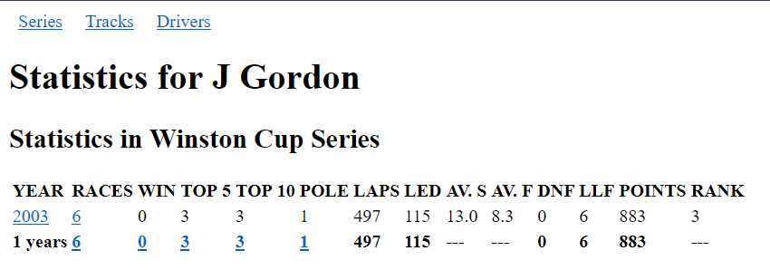
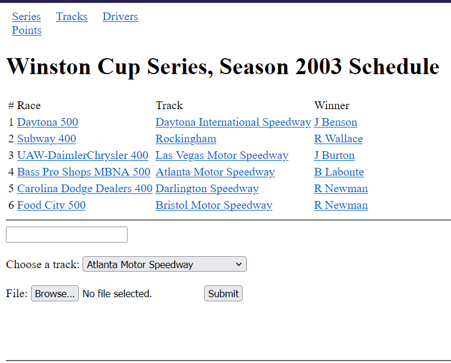

# NR2003 Stats Generator

NR2003 Stats Generator (NRSG) is a locally deployable web application that manages statistics and history of racing divisions and drivers with HTML export files generated by NR2003.

## Features
- Organize races into entire series with seasons
- View race information such as results, practice, qualifying, happy hour, and penalties
- Create, view, update, and delete the following:
  - Drivers
  - Teams
  - Point Systems
  - Series
  - Seasons

## Some Screenshots

*Screenshot of an individual driver's page*

*Screenshot of a season page*

*Screenshot of a points page*

## Installation
There are two ways to install NRSG:

### Using the EXE
Download the EXE in the release section 

note: Only Windows users or any user emulating a Windows OS can use it. This has only been tested for Windows 10.

### BIY (Build it Yourself)
Requirements
- Python 3.10
- Pip module

1. Create a virtual environment with venv
2. Enter virtual environment
3. Install packages in [requirements.txt](./requirements.txt) with command `pip install -r requirements.txt`
4. Go to [./src](./src/) and run `pyinstaller ./options.spec`
   
The generated executable should be present in a dist/options folder generated after running the pyinstaller command.

Copy the config.ini file [here](./src/config.ini) and paste it into the generated folder.

## Configuration
There is a configuration file called `config.ini`.
Inside, there is a setting named "DBPath".
You can adjust it to a path of a database file you wish to create or connect to.

If you enter a path to a database file that does not exist, NRSG will create it there.

If you are following the BIY method, you **must** copy the config.ini file [here](./src/config.ini) and paste it into the folder containing the executable at the same level.

Note: **DO NOT DEPLOY** onto a live server! This application was not designed for deployment as the SQL queries in the backend are stored as parameterized strings, making it prone to SQL injection attacks.

*Documentation/FAQ will be created at a later date*